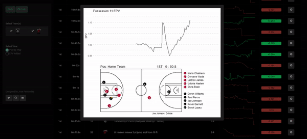

# EPV Dashboard
A minimal app to visualize Expected Possession Value (EPV) in the NBA.

***

Exploring an idea to visualize and interact with EPV in Basketball. The dashboard provides information at a play by play level for a full game as well as the player total EPV added for that game. A dynamic play diagram alongside the EPV can be displayed for all available plays.. 

* Live App: [Link](https://josedv.shinyapps.io/EPV_NBA_Dashboard/)

*The app is not intended to work on mobile devices.*

#### References

Cervone, D., D’Amour, A., Bornn, L., & Goldsberry, K. (2016). **A multiresolution stochastic process model for predicting basketball possession outcomes.** Journal of the American Statistical Association, 111(514), 585-599. [Link](https://arxiv.org/abs/1408.0777)

Cervone, D., D’Amour, A., Bornn, L., & Goldsberry, K. (2014). **POINTWISE: Predicting Points and Valuing Decisions in Real Time with NBA Optical Tracking Data.** Sloan Sport Analytics Conference. [Link](http://www.lukebornn.com/papers/cervone_ssac_2014.pdf)

#### Data

The EPV data was sourced from https://github.com/dcervone/EPVDemo
